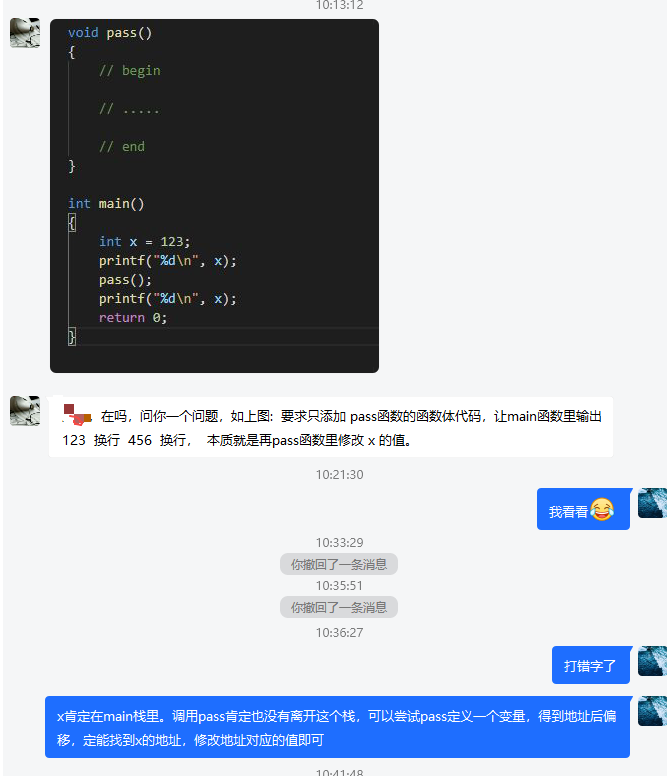

# Interest_questions
# 收录一些有意思的问题

# 题目一:

早上朋友发了个有意思的问题



**题目如下**: 要求只添加 pass函数的函数体代码，让main函数里输出123  换行  456  换行，  本质就是再pass函数里修改 x 的值。

```c
void pass()
{
    // begin
    
    // ....
    
    // end
}

int main()
{
    int x = 123;
    printf("%d\n", x);
    pass();
    printf("输出: %d\n", x);
    return 0;
}

```

**解法一**: 看这个问题，我第一想到的是使用地址偏移量来解答。局部变量压栈，存储在栈区，栈是从高地址到低地址存储，所以随便定义一个变量，又因为是个整型，所以按整形地址偏移量进行偏移，定能在附近找到 main函数中的 x的地址， 修改x 的地址对应的值即可


```c++
#include <iostream>
#include <stdio.h>
#include <string.h>

using namespace std;

void pass()
{

    int tmp_val = 0;
    for (int i = 0; i < 20; ++i)
    {
        printf("22222===%d = %p, %d\n", i, ((&tmp_val) + i), *((&tmp_val) + i));
        if (*((&tmp_val) + i) == 123)
        {
            *((&tmp_val) + i) = 456;
        }
    }
}

int main()
{

    int x = 123;

    printf("1111===%d,   %p\n", x, &x);
    pass();
    printf("输出: %d\n", x);

    return 0;
}

```


**解法二**: 使用内嵌汇编


```c

void pass()
{
    void *rbp_addr = 0;
    __asm__ __volatile__(
        "movq %%rbp, %0"
        : "=r"(rbp_addr));
    void *main_rbp_addr = (void *)(*(long *)(rbp_addr));
    int *x_addr = main_rbp_addr - 4;
    *x_addr = 456;
}

int main()
{
    int x = 123;
    printf("x = %d\n", x);
    pass();
    printf("x = %d\n", x);
}

```

